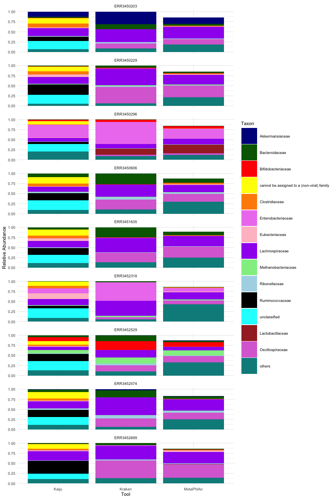

# Gut Microbiome Metagenomics Replication Study

This is a replication and validation of the Mas-Lloret et al. (2020) study titled: *"Gut microbiome diversity detected by high-coverage 16S and shotgun sequencing of paired stool and colon sample"* (Scientific Data) using the updated tools, completed as a part of coursework for Johns Hopkins University.

## Background
 
The human gastrointestinal (GI) tract hosts a large and diverse population
of microorganisms. These are collectively known as the gut microbiota.
The gut microbiota is influenced by many factors such as diet, host
immune system, environment, lifestyle, etc. The GI microbiota plays an
important role in the development of the intestinal mucus and the body’s
immune system.

To understand the gut microbiome diversity, shotgun sequencing was
done for fecal samples in a study by Mas-Lloret, et.al in 2020. The taxonomic classification of samples would vary slightly depending on the tool and the databases used to classify them. Validating the tools with more recent databases yields more information due to the inclusion of newly discovered organisms and classifications. This particular study validates the quality control and taxonomic classification methods in the original Mas-Lloret et al. (2020) study, using three taxonomic classifiers: Kraken, MetaPhlAn, and Kaiju.

## Data

- **Source:** Mas-Lloret et al. (2020), raw shotgun sequencing reads
- **Accession:** ENA PRJEB33098
- **Samples:** 9 fecal samples (AE1235–AE1243)
- **Size:** ~88 Gb, paired-end FASTQ
- **Processing environment:** Google Cloud Platform (data staged from a storage bucket to a compute instance)

## Methods

### Quality control
- **FastQC** for initial quality assessment
- **Clumpify** (BBTools) for deduplication
- Quality trimming on both read ends to a minimum PHRED score of 20
- **BBDuk** (BBTools) for adapter removal
- Read pairs shorter than 75 bp after trimming were discarded

### Taxonomic classification
Three classifiers were run on the QC'd reads:

| Tool | Database | Parameters |
|---|---|---|
| Kraken2 | Standard-16, built 2025 | Confidence threshold 0.1 |
| MetaPhlAn4 | CHOCOPhlAn SGB, Jan 2025 | Default |
| Kaiju | ProGenomes, built 2021 | Default |

MetaPhlAn4 is the newer version as compared to the MetaPhlAn2 used in the original 2020 study. Kraken2 and Kaiju were also run with the more recent databases than the ones in the original study.

## Results

### Quality control

The trimming percentages were mostly consistent with the original study. Out of the 9 samples, 6 of them showed good consistency with only
slight discrepancies. However, two samples showed less trimming,
AE1236 and AE1241 while sample AE1237 showed large discrepancy
with increased trimming.

| Sample | Trimming — original (%) | Trimming — validation (%) |
|---|---:|---:|
| AE1235 | 19.91 | 20.68 |
| AE1236 | 22.94 | 20.68 |
| AE1237 | 19.34 | 26.08 |
| AE1238 | 18.36 | 22.19 |
| AE1239 | 20.47 | 20.14 |
| AE1240 | 18.65 | 20.87 |
| AE1241 | 19.11 | 17.23 |
| AE1242 | 18.67 | 19.82 |
| AE1243 | 16.01 | 20.19 |

### Taxonomic classification

The top 15 taxa observed across all three classifiers in this study were mostly similar to the ones reported in the original study. The two differences noted are:

- **Oscillospiraceae in sample AE1243:** 
MetaPhlAn4 (validation) classified reads to Oscillospiraceae that MetaPhlAn2 (original study) had left unclassified which was probably due to the fact that this particular taxon was not represented in the MetaPhlAn2 database. 

- **Ruminococcaceae:** 
Ruminococcaceae was one of the most abundant taxa found in the original study but it was detected at a lower abundance especially by Kraken2. There was no Ruminococcaceae in the Kraken2 and MetaPhlAn4 classifications. This is due to the fact that the naming convention for the taxon changed from Ruminococcaceae to Oscillospiraceae as per Tindall (2019). However, Kaiju still classified species between Ruminococcaceae and Oscillospiraceae because the Kaiju database did not incorporate the updated naming convention. The original Mas-Lloret et al. (2020) study was published a year after the change of naming convention and therefore, the databases may not have been updated to include the naming convention change. This finding reiterates the importance of re-running old datasets with the newer databases.


*Figure 1: Relative abundance by family across all 9 samples, Kaiju/Kraken2/MetaPhlAn4 (this validation).*

The `results/figures/` contain the full comparison against the original study's published figure.

## Conclusion

Metagenomics tools are constantly being updated, in terms of both tool
itself as well as the databases used. Rerunning old datasets with newer
tools and databases can lead to newer conclusions or validate the older
ones. Due to the vast number of organisms being discovered and the
improvement in tools, metagenomics studies are continuously in need
for validations. Proper documentation of metagenomics analysis and
establishing pipelines to automatically use the updated versions of tools
and databases can help in simplifying the process.


## Repository structure

```
scripts/
  qc/              # FastQC, clumpify, BBDuk commands
  classification/  # Kraken2, MetaPhlAn4, Kaiju run commands
  reports/         # Kraken+Bracken report merging (Python), Kaiju/MetaPhlAn report generation (bash)
  plotting/        # R script for plots
results/
  figures/         # Final comparison plots
  kaiju/           # Kaiju classification output
  kraken+bracken/  # Kraken2 + Bracken classification output
  metaphlan/       # MetaPhlAn4 classification output
LICENSE
```

## References

Mas-Lloret, J., Obón-Santacana, M., Ibáñez-Sanz, G., Guinó, E., Pato, M. L., Rodriguez-Moranta, F., Mata, A., García-Rodríguez, A., Moreno, V., & Pimenoff, V. N. (2020). Gut microbiome diversity detected by high-coverage 16S and shotgun sequencing of paired stool and colon sample. *Scientific Data*, 7(1), 92. https://doi.org/10.1038/s41597-020-0427-5

Mas-Lloret, J. (n.d.). *colonbiome-pilot* [Source code]. GitLab. https://gitlab.com/JoanML/colonbiome-pilot

Tindall, B. J. (2019). The names *Hungateiclostridium* Zhang et al. 2018... [and other combinations] contravene Rule 51b of the International Code of Nomenclature of Prokaryotes and require replacement names in the genus *Acetivibrio* Patel et al. 1980. *International Journal of Systematic and Evolutionary Microbiology*, 69(12), 3927–3932. https://doi.org/10.1099/ijsem.0.003685

